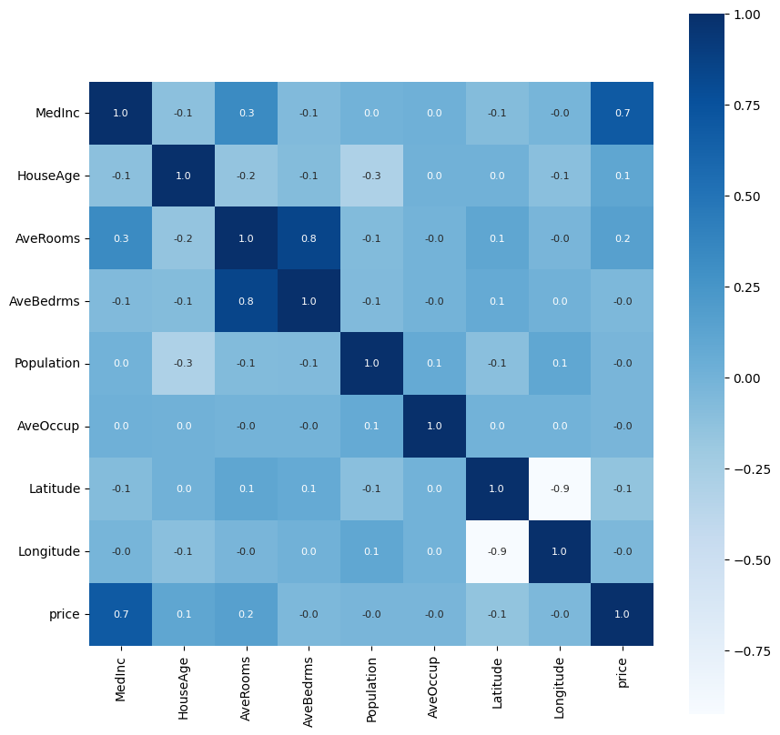
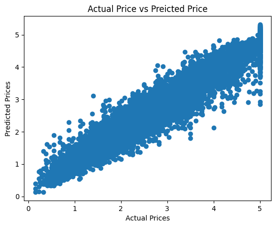

# 🏡 California Housing Price Prediction

This project predicts California housing prices using machine learning models.  
The dataset is sourced from `sklearn.datasets.fetch_california_housing`.

---

## 📌 Project Overview

- ✅ Dataset: California Housing
- 🎯 Goal: Predict median house prices
- ⚙️ ML Models:  XGBoost Regressor
- 📈 Performance:
  - R² Score: **0.94**
  - MAE: **0.19**

---

## 📊 Workflow

1. Data Loading & Exploration
2. Data Cleaning & Preprocessing
3. Correlation Analysis (Heatmap)
4. Model Training (XGBoost)
5. Evaluation Metrics
6. Predicting on Test Data
7. Visualization of Actual vs Predicted Values

---

## 🔍 Visualizations

> Heatmap showing feature correlations  
> Scatter plot comparing actual vs predicted values

---

## 🧪 Libraries Used

pandas
numpy
matplotlib
seaborn
scikit-learn
xgboost

